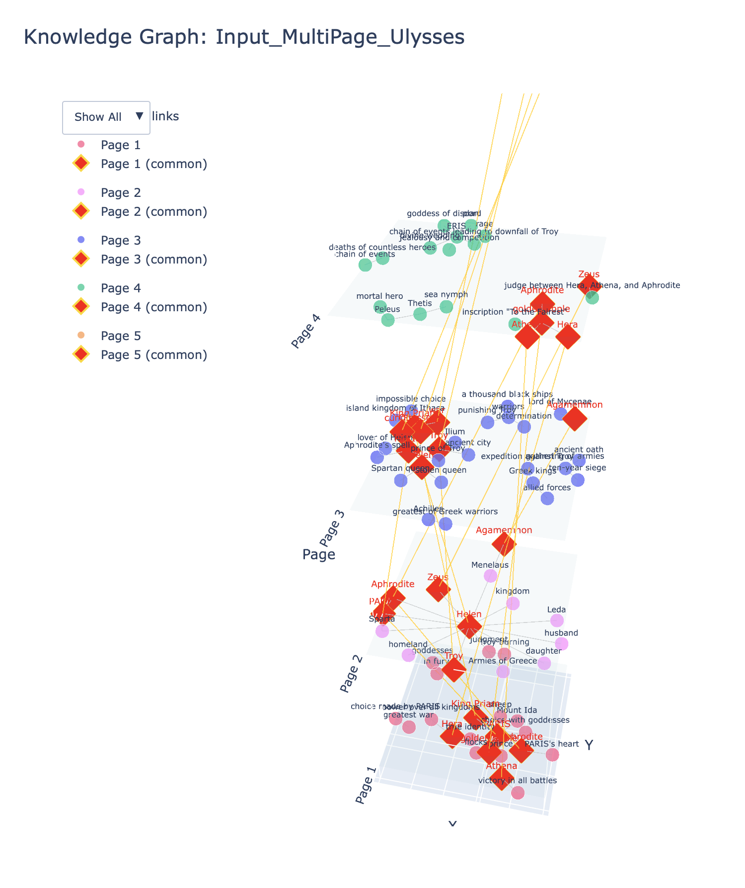
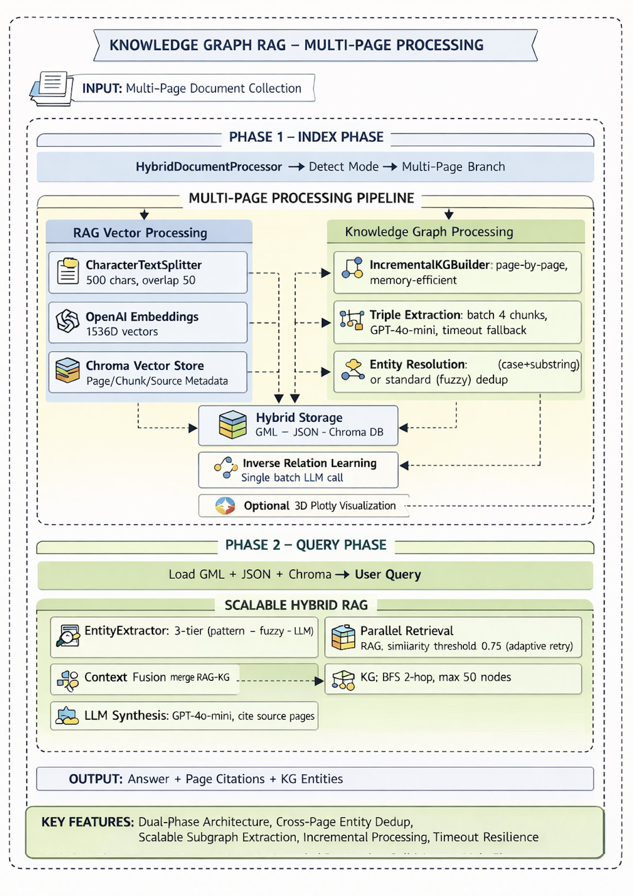
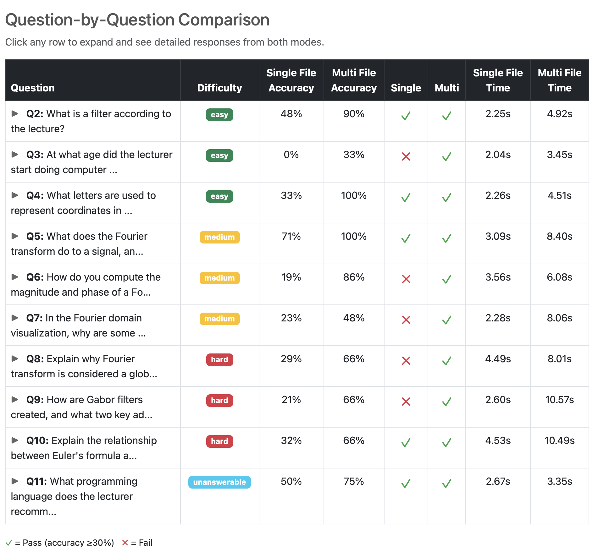

# Knowledge Graph RAG CLI

## What's New in v3

### Multi-Page Processing
- **`--input-dir`** mode: Index entire directories of page files
- Cross-page entity tracking with deduplication
- Page citations in query responses

### Hybrid RAG + Knowledge Graph
- Parallel retrieval: semantic search (Chroma) + graph traversal (BFS, 2-hop)
- Context fusion merges both sources before LLM synthesis
- Configurable similarity threshold with adaptive retry

### Entity Deduplication
- Light mode (default): case-insensitive + substring matching
- Standard mode: adds fuzzy matching
- Tracks canonical names and aliases across pages

### Incremental KG Builder
- Replaces `GraphIndexCreator` with batch-optimized extraction
- Processes 4 chunks per LLM call with timeout resilience
- Verbose extraction mode for richer graphs (default)

### Smart Visualization
| Graph Size | Strategy |
|------------|----------|
| < 50 nodes | Full interactive PyVis |
| 50-150 | Community detection coloring |
| 150-300 | Top 100 nodes by centrality |
| 300+ | Statistical dashboard |

- New: 3D Plotly visualization (`--viz3d`)



### New CLI Options
| Flag | Description |
|------|-------------|
| `--input-dir` | Multi-page directory mode |
| `--force-rebuild` | Delete existing index before rebuild |
| `--viz3d` | Generate 3D interactive graph |
| `--similarity-threshold` | RAG retrieval threshold (default: 0.75) |
| `--no-entity-resolution` | Disable deduplication |
| `--compact-extraction` | Use minimal extraction (vs verbose default) |

---

## Architecture



---

## Performance Comparison



*See the [full interactive report](https://plouismarie.github.io/kg_rag_cli/Report/kg_mode_comparison_report.html) for detailed benchmark results and analysis.*

---

## How does it work?

A command-line tool for building and querying knowledge graphs from text documents. The CLI provides two operational modes (**single-file** and **multi-page**) with two commands (**index** and **query**):

- **Single-File Mode**: Process individual text files (original functionality)
- **Multi-Page Mode**: Process directories containing multiple page files (NEW)
- **Index Command**: Extract knowledge triples from text, compute inverse relations, and save the graph
- **Query Command**: Load a saved graph and answer natural language questions using RAG

The system uses:
- **LLM-based Triple Extraction**: Automatically identifies (Subject, Predicate, Object) relationships
- **Entity Deduplication**: Merges similar entities (e.g., "Paris", "paris", "Prince Paris") across documents (NEW)
- **Hybrid RAG+KG**: Combines vector similarity search with knowledge graph traversal (NEW - multi-page mode)
- **Batch Inverse Learning**: Computes inverse relations in a single optimized LLM call
- **Graph Persistence**: Saves graphs in GML format for fast loading
- **Smart Visualization**: Full graphs for single files, query-specific subgraphs for multi-page collections (NEW)

## Prerequisites

- Python 3.10+
- OpenAI API key

## Setup

1. Install the required dependencies:
```bash
pip install -r requirements.txt
```

2. Set your OpenAI API key:
```bash
export OPENAI_API_KEY="your-api-key-here"
```

## Usage

### Single-File Mode

#### Index a Document

Build a knowledge graph from a single text file:
```bash
python kg_rag_cli.py --mode index --input mybook.txt
```

The system will:
1. Load your text document
2. Extract knowledge triples using the LLM
3. Apply entity deduplication (enabled by default)
4. Compute inverse relations in a single batch call
5. Save the graph to `kg_store/mybook.txt.gml`
6. Generate visualization at `kg_store/mybook.txt.html`

#### Query an Index

Ask questions about an indexed document:
```bash
python kg_rag_cli.py --mode query --input mybook.txt --question "Who is the main character?"
```

### Multi-Page Mode (NEW)

#### Index a Directory

Process multiple page files at once. The collection name is **optional** - if not provided, it will be auto-derived from the directory path.

**With auto-derived collection name:**
```bash
python kg_rag_cli.py --mode index --input-dir Input/MultiPage/Ulysses/
# Collection name will be: Input_MultiPage_Ulysses
```

**With explicit collection name:**
```bash
python kg_rag_cli.py --mode index --input-dir Input/MultiPage/Ulysses/ --collection ulysses_multi
```

This will:
1. Find all `.txt` files in the directory (customizable with `--file-pattern`)
2. Build a RAG vector store for semantic search
3. Extract knowledge graph with entity deduplication across all pages
4. Show entity resolution statistics
5. Save both RAG and KG to `kg_store/ulysses_multi/`

Example output:
```
============================================================
MULTI-PAGE INDEXING MODE
============================================================
Directory: Input/MultiPage/Ulysses/
Collection: ulysses_multi
File pattern: *.txt
Entity resolution: enabled
============================================================

[1/2] Building RAG vector store and knowledge graph...
[HybridProcessor] Found 5 pages in Input/MultiPage/Ulysses/
...

[Processing Complete]
  Pages processed: 5
  RAG chunks: 87
  KG triples: 145
  KG entities: 62
  RAG time: 12.3s
  KG time: 45.7s

[2/2] Entity Deduplication Statistics...
  Canonical entities: 62
  Total aliases: 98
  Total mentions: 287
  Deduplication ratio: 1.58
  Most merged entities:
    - Paris: 23 mentions
    - Ulysses: 18 mentions
    - Telemachus: 15 mentions
```

#### Query a Multi-Page Index

Query using hybrid RAG+KG. Use the **same collection name** (or omit it if you used auto-derived):

**Query with auto-derived collection:**
```bash
# If you indexed with: --input-dir Input/MultiPage/Ulysses/
# Query with the same directory (collection auto-derived to Input_MultiPage_Ulysses):
python kg_rag_cli.py --mode query --input-dir Input/MultiPage/Ulysses/ --question "Who is Paris?"
```

**Query with explicit collection:**
```bash
python kg_rag_cli.py --mode query --collection ulysses_multi --question "Who is Paris?"
```

This will:
1. Load the hybrid RAG+KG system
2. Retrieve relevant text chunks (RAG)
3. Extract relevant knowledge subgraph (KG)
4. Generate answer combining both sources
5. Create query-specific visualization (subgraph only)

Example output:
```
============================================================
MULTI-PAGE QUERY MODE
============================================================
Collection: ulysses_multi
Question: Who is Paris?
============================================================

[1/3] Loading hybrid RAG+KG system...
[2/3] Querying hybrid system...

============================================================
RESPONSE
============================================================
Paris is a prince of Troy who appears in the story...
[Combined answer from RAG chunks and KG relationships]

============================================================
QUERY DETAILS
============================================================
  Query entities found: ['Paris', 'Troy', 'Helen']
  RAG chunks used: 7
  KG nodes used: 23
  KG edges used: 45

  Source pages:
    - page0001.txt (page 1)
    - page0003.txt (page 3)
    - page0004.txt (page 4)

[3/3] Generating query visualization...
  Saved visualization: ulysses_multi_query_1706024567.html
```

### Options

#### Common Options

| Flag | Short | Description |
|------|-------|-------------|
| `--mode` | `-m` | Required. Either `index` or `query` |
| `--question` | `-q` | Required for query mode. The question to ask |
| `--no-visualize` | | Skip HTML visualization generation |
| `--verbose` | `-v` | Enable detailed output with timing |

#### Single-File Mode Options

| Flag | Short | Description |
|------|-------|-------------|
| `--input` | `-i` | Path to text file (index) or filename (query) |

#### Multi-Page Mode Options

| Flag | Short | Description |
|------|-------|-------------|
| `--input-dir` | | Directory containing page files |
| `--collection` | `-c` | Collection name (optional: auto-derived from `--input-dir` if not specified) |
| `--file-pattern` | | Glob pattern for page files (default: `*.txt`) |
| `--no-entity-resolution` | | Disable entity deduplication (default: enabled) |

## Example Output

### Indexing
```bash
$ python kg_rag_cli.py --mode index --input Ulysses.txt
Loading document: Ulysses.txt
Extracting knowledge triples...
Learning inverse relations...
Saved graph: kg_store/Ulysses.txt.gml
Generated visualization: kg_store/Ulysses.txt.html

Index 'Ulysses.txt' created successfully!
  Nodes: 24
  Triples: 48
```

### Querying
```bash
$ python kg_rag_cli.py --mode query --input Ulysses.txt --question "Who is Telemachus?"
Loading graph: kg_store/Ulysses.txt.gml

Question: Who is Telemachus?

Answer: Telemachus is the son of Odysseus and Penelope...
```

### Missing Index
```bash
$ python kg_rag_cli.py --mode query --input missing.txt --question "test"
Error: Index 'missing.txt' not found.

Please build the index first with:
  python kg_rag_cli.py --mode index --input missing.txt
```

## License

This project is licensed under the MIT License.
